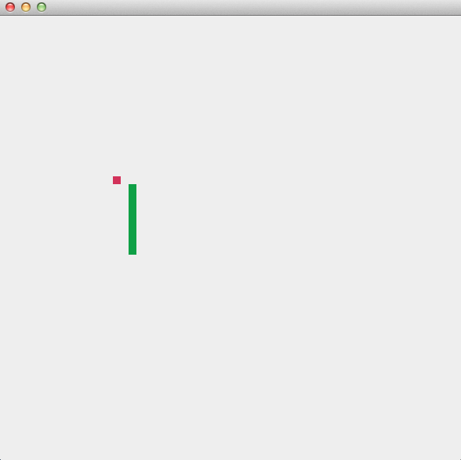

#The Snake Game with RX and Monads

This is an experiment in comparing 3 approaches for managing state: plain functional, RX and state monads. Reusing code
from https://github.com/globulon/akka-snake and https://github.com/dgalichet/StateMonadSample .

##Functional

GameStateVars.scala

      var snake: Snake = _
      var apple: Apple = _
      reset()

      def reset() {
        snake = Snake(List(origin), Direction.Right)
        apple = Apple(randomLocation())
      }

      def updatePositions(fromSnake: Snake, fromApple: Apple) {
        fromSnake.body match {
          case head :: tail if head == fromApple.location =>
            apple = Apple(randomLocation())
            snake = fromSnake.grown
          case head :: tail if tail.contains(head) =>
            listener ! ShowMessage("You lose")
            reset()
          case head :: tail if tail.size == World.winLength =>
            listener ! ShowMessage("You win")
            reset()
          case _ => snake = fromSnake.moved
        }

        listener ! Updated(snake.body, apple.location)
      }

      def updateDirectionOf(withSnake: Snake, to: WorldLocation) {
        snake = withSnake.go(to)
      }

##Reactive

GameStateRX.scala

      val events: PublishSubject[Event] = PublishSubject[Event]

      val snakeObservable = createSnake(Snake(List(origin), Direction.Right), events)

      val appleObservable = createApple(randomLocation(), snakeObservable, events)

      snakeObservable.combineLatest(appleObservable).subscribe(
        pair => {
          listener ! Updated(pair._1.body, pair._2)
        },
        (t: Throwable) =>  t.printStackTrace(),
        () => {}
      )

      val tick = Observable.interval(Duration(150, TimeUnit.MILLISECONDS))

      tick.subscribe(
        (_ => events.onNext(Move())),
        (t: Throwable) => println("tick error : " + t),
        () => {}
      )

      def createSnake(init: Snake, events: Observable[Event]): Observable[Snake] = {
        events
          .scan(init)((snake, event) => event match {
            case Move() => snake.moved
            case Grow() => snake.grown
            case Turn(direction) => snake.go(direction)
          })
      }

      def createApple(init: WorldLocation, snakeObservable: Observable[Snake], events: Subject[Event, Event]): Observable[WorldLocation] = {
        snakeObservable.scan(randomLocation())((loc: WorldLocation, snake: Snake) => snake.head match {
          case head if (head == loc) => {
            events.onNext(Grow())
            randomLocation()
          }
          case _ => loc
        })
      }

      case class Snake(body: List[WorldLocation], direction: WorldLocation) {
        def go(toDirection: WorldLocation): Snake = Snake(body, toDirection)
        def moved: Snake = Snake((head + direction) :: body.take(body.size - 1), direction)
        def grown: Snake = Snake((head + direction) :: body, direction)
        def head: WorldLocation = body.head
      }

##State Monad

GameStateMonad.scala

      var playground: Playground = _
      var state: State[Playground, Score] = _

      def reset(snakeOpt: Option[Snake]) {
        playground = Playground(
          WorldLocation(0, 0),
          WorldLocation(World.width - 1, World.heigth - 1),
          randomLocation(),
          snakeOpt.getOrElse(Snake(Position(15, 15, North) :: Nil)))

        state = State[Playground, Score] {s =>
            (s, s.snake.score)
        }
      }

      reset(None)

      def receive = monad
      def monad: Receive = {
        case Refresh() => {
          state = state.flatMap(_ => compileDirection(Unknown))
          notifyListener(state.run(playground)._1)

        }
        case UpdateDirection(to) => {
          state = state.flatMap(_ => compileDirection(toDirection(to)))
          notifyListener(state.run(playground)._1)
        }
      }
##Conclusions

The functional version uses immutable data structures to represent the snake and apple, but is also using vars that
get reassigned. It can definitely be made more functional (see here: https://gist.github.com/mslinn/1314819)

State Monads are more appropriate for algorithms that involve predefined steps and running those steps on various
input values. In a game situation the starting state is fixed and the steps depend on the user input, so using a
state monad for an interactive game may not be the best choice. We are resetting the monad when the snake grows and
we replay all the steps  with each move. A BehaviorSubject or ReplaySubject can do the same in the RX world.

The reactive version is pretty much "pull free", all the values get pushed, there is no direct reading from vars.
A nice JavaScript (Bacon) version  of the snake game can be found here: http://philipnilsson.github.io/badness/ .
Perhaps RX can be a great alternative to state monads.